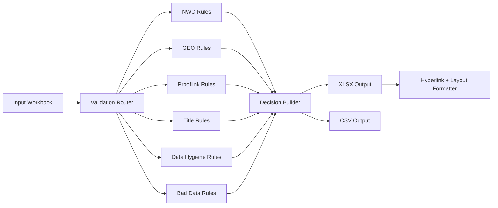

# Lead Data Validation Engine

`lead-data-validation-engine` is a deterministic backend workflow for validating CRM leads exported from operations spreadsheets. It converts loosely structured lead data into auditable decisions with two explicit outputs per row: `Result` and `Comment`.

This repo is meant to show engineering thinking, not just task completion:
- domain-driven validation rules instead of ad hoc spreadsheet edits
- explainable pass/fail/recheck comments for every decision
- a clear separation between rule evaluation, batch orchestration, and Excel formatting
- production signals through tests, a QA script, packaging metadata, and CI

## Why This Matters

Lead operations data is messy. Titles are inconsistent, proof links vary in quality, and requirement text mixes structured fields with free-form comments. A useful backend solution needs to optimize for:
- deterministic decisions where the input is machine-readable
- explicit `RECHECK` paths where the data is ambiguous
- auditability so analysts can understand why a row was accepted or rejected
- low-friction outputs that operations teams can open immediately in Excel

## System Overview



Current implementation layers:
- `lead_data_validator.py`: core validation engine and CLI entrypoint
- `qa_check.py`: post-run QA guardrail for generated workbooks
- `tests/`: unit and integration tests around business rules
- `ARCHITECTURE.md`: system-design view, scaling path, and CRM evolution strategy
- `LOGIC.md`: implementation-level rule breakdown

## Domain Model

Even though the current adapter is file-based, the business domain maps cleanly to CRM entities:

| Entity | Role |
| --- | --- |
| `Lead` | Person/company row being validated |
| `ValidationRequirement` | Parsed constraints from the `req` field |
| `ValidationEvidence` | Proof links, email domain, title, and status signals |
| `ValidationDecision` | `VALID`, `INVALID`, or `RECHECK` plus explanation |
| `ValidationRun` | Batch execution over a workbook export |
| `Reviewer/User` | Human operator consuming outputs or resolving rechecks |

Relationships:
- one `ValidationRun` processes many `Lead` records
- one `Lead` carries one requirement profile per source row
- one `Lead` can emit one primary `ValidationDecision` in the current batch model
- future CRM versions would allow many decisions over time for audit history

## Key Engineering Decisions

### 1. Deterministic rule engine over fuzzy scoring
- Chosen because lead-ops workflows need traceable decisions.
- Tradeoff: lower coverage on ambiguous free-text requirements.
- Mitigation: non-deterministic requirement markers are treated conservatively instead of forcing false precision.

### 2. `pandas` for batch I/O, `openpyxl` for reviewer-facing Excel output
- `pandas` handles row-based data transformation efficiently.
- `openpyxl` is used only after decisioning, for hyperlinks, wrapping, and workbook usability.
- Tradeoff: two-step output flow adds an extra pass over the workbook.
- Benefit: clean separation between business logic and presentation formatting.

### 3. Header-driven formatting instead of hard-coded Excel columns
- The formatter now identifies columns by header name.
- This avoids silent breakage if source columns move.

### 4. Safer title rule parsing
- Title-level matching now uses phrase-based rank detection instead of single-letter substring checks.
- Placeholder requirement values such as `-` and `see comment` are no longer treated like deterministic constraints.
- Mixed job-level strings such as `ANY level ... Manager+` are treated as non-deterministic instead of forcing a false single threshold.
- This reduces false negatives and makes the validator more defensible.

### 5. Explicit handling for GEO and bad-data statuses
- `Country/GEO` rows now auto-validate only when location text resolves to a single allowed country.
- Ambiguous geography is pushed to `RECHECK` instead of being silently accepted.
- `Out of Business/Bad data` rows are explicitly invalidated instead of falling through baseline checks.

## Scalability Thinking

The current version is a single-process batch engine, which is the right tradeoff for a take-home style workflow and analyst-operated Excel exports. The scaling path is already documented and intentionally straightforward:
- cache parsed requirement profiles by unique `req` value
- split validation from formatting so worker nodes only do rule evaluation
- persist leads, requirements, decisions, and review tasks in a relational store
- move workbook ingestion and export generation behind queued background jobs
- add audit tables or append-only events for reviewer actions and rule changes

For a deeper system-design view, see [ARCHITECTURE.md](./ARCHITECTURE.md) and [COUNTRY_CHECK_SCALING_NOTES.md](./COUNTRY_CHECK_SCALING_NOTES.md).

## Getting Started

```bash
python3 -m venv .venv
source .venv/bin/activate
pip install -e .[dev]
lead-data-validation-engine
lead-data-qa
pytest
```

Default artifacts:
- input: `DataCheck_DemoCode.xlsx`
- outputs: `Lead_Data_Validation_Results.xlsx`, `Lead_Data_Validation_Results.csv`

You can also override paths explicitly:

```bash
python3 lead_data_validator.py --input DataCheck_DemoCode.xlsx --output-xlsx Lead_Data_Validation_Results.xlsx --output-csv Lead_Data_Validation_Results.csv
python3 qa_check.py --input DataCheck_DemoCode.xlsx --output Lead_Data_Validation_Results.xlsx
```

## Reliability Signals

- `tests/test_lead_data_validator.py` covers title parsing, GEO resolution, prooflink rules, bad-data handling, NWC behavior, and output generation.
- `qa_check.py` validates row counts, appended decision columns, output semantics, and hyperlink presence.
- `.github/workflows/ci.yml` runs the test suite on push and pull request.

## Repository Map

- [lead_data_validator.py](./lead_data_validator.py)
- [qa_check.py](./qa_check.py)
- [ARCHITECTURE.md](./ARCHITECTURE.md)
- [LOGIC.md](./LOGIC.md)
- [COUNTRY_CHECK_SCALING_NOTES.md](./COUNTRY_CHECK_SCALING_NOTES.md)

## Next Evolution

If this moved from spreadsheet batch processing into a productized CRM subsystem, the next steps would be:
- normalize requirements into first-class database records
- store evidence and decisions separately for auditability
- expose manual review queues for `RECHECK` outcomes
- version rules so historical decisions remain reproducible
- add tenant-aware ingestion, queues, and metrics for high-volume customers
